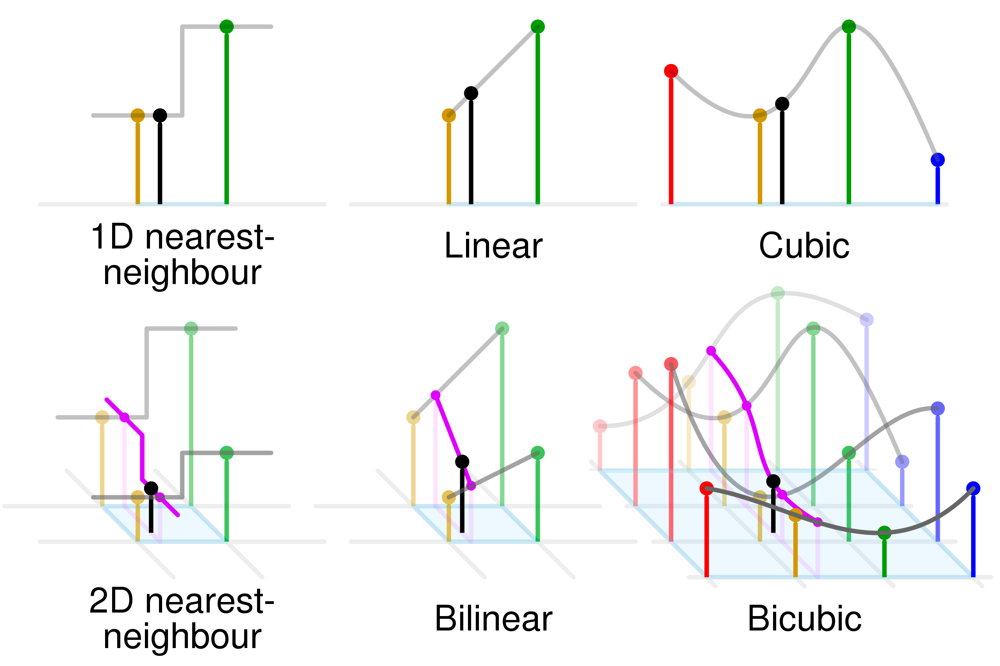
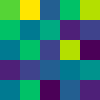
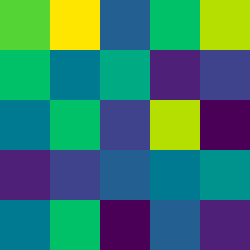
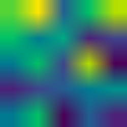
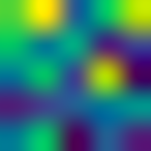

= Image interpolation

This is my own implementation of image interpolation. Used for upscale (and downscale) of images.

I have no initial ambitions to make this the fastest or leanest resource consuming algorithm out there.
This project and implementations are made to explore techniques and algorithms to support texture interpolation in my raytracing endeavours as I can not use traditional algorithms or libraries on my own proprietary internal image format. (Plus I need to account for texture wrap and flipping on tiling textures.)

== License

https://creativecommons.org/publicdomain/zero/1.0/[CC0 - Creative Commons 0 (v1.0)]

image::http://mirrors.creativecommons.org/presskit/buttons/80x15/png/cc-zero.png[CC0]

== Dependencies

Nope. No exotic dependencies to mention.

This library applies to the vanilla images as provided by the standard go library `image`.

== TODO

* Make sure all calculations are made on alpha and not premultiplied color values.
* Make sure to calculate all interpolation is done in linear space not gamma space.

== Testing

No extensive mathematical testing nor unit tests has been done.

IMPORTANT: https://sv.wikipedia.org/wiki/WYSIWYG[WYSIWYG] - literally.

== Algorithms

Algorithms are created from scratch based on information found at wikipedia.

All algorithms are working in RGB space.

(Wikipedia is fantastic source of knowledge, if you use it more than 5 times a year consider what it saves you in time and other expenses for dictionaries, courses, and wasted time searching. https://donate.wikimedia.org/wiki/Ways_to_Give[Give them a contribution] to keep it running and open.)

* https://en.wikipedia.org/wiki/Nearest-neighbor_interpolation[Nearest neighbour interpolation]
* https://en.wikipedia.org/wiki/Bilinear_interpolation[Bilinear interpolation]
* https://en.wikipedia.org/wiki/Bicubic_interpolation[Bicubic interpolation] using https://en.wikipedia.org/wiki/Cubic_Hermite_spline[(cubic hermite spline)]

.Different interpolation algorithms. https://en.wikipedia.org/wiki/Bilinear_interpolation#/media/File:Comparison_of_1D_and_2D_interpolation.svg[Illustration] by https://commons.wikimedia.org/wiki/User:Cmglee[Cmglee] at wikipedia CC BY-SA 4.0.

* Pixel boxing, used for down scaling an image. An image can be reduced by an integer factor in both width and height dimension. As pixels are evenly averaged during reduction the average color information is preserved. A (small) rounding error going from floating point values to integers is introduced upon consecutive reductions.

== Results

=== Upscale

These algorithms can be used for upscaling an image.

.*Original image* used for upscale examples. (This image is just a large preview. The actual original image is merely the 5x5 pixels.)

==== Nearest neighbour

.The original image of 5x5 pixels upscaled to 250x250 pixels using *nearest neighbour* interpolation.

==== Bilinear

.The original image of 5x5 pixels upscaled to 250x250 pixels using *bilinear* interpolation.

==== Bicubic (using Cubic Hermite spline)

.The original image of 5x5 pixels upscaled to 250x250 pixels using *bicubic* interpolation (using Cubic Hermite spline).

